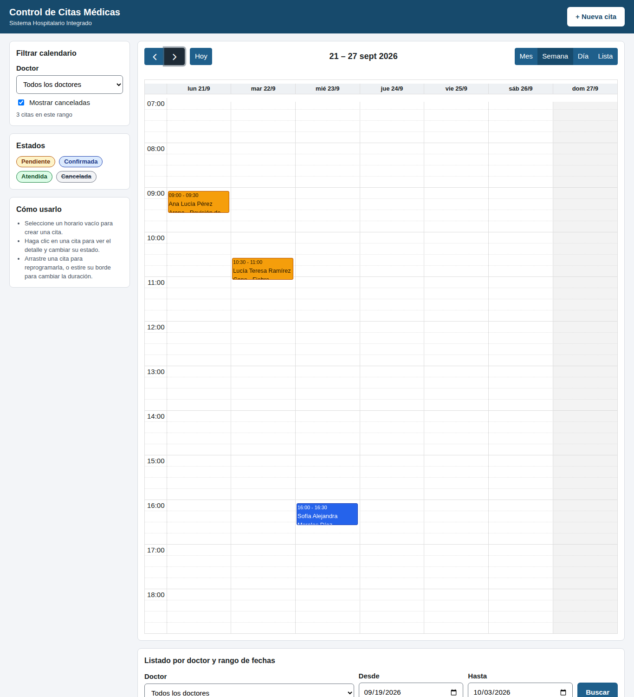

# Evidencia — Serie II, Control de Citas Médicas

Generado por `scripts/evidencia.ps1` el 2026-09-19 09:45 en el equipo del estudiante.
Todas las salidas son reales y se copian tal como las devolvió cada comando.

| Dato | Información |
|---|---|
| Estudiante | Eddy Adolfo Castro Véliz |
| Código | 1890-23-16857 |
| Repositorio | https://github.com/EddCastro/his-control-citas |

## Trazabilidad requisito → evidencia

| Requisito | Evidencia |
|---|---|
| RQF-01 Crear cita | Salida 9, captura 02 y 03 |
| RQF-02 Calendario mes y semana | Capturas 01 y 09 |
| RQF-03 Impedir doble reserva | Salidas 11, 12 y 22; captura 04 |
| RQF-04 Reprogramar con drag & drop | Salida 15; capturas 07 y 08 |
| RQF-05 Cancelar sin eliminar | Salidas 18, 19, 20 y 21 |
| RQF-06 Filtrar por doctor y rango | Salida 8; capturas 10 y 11 |
| RQF-07 API CRUD y lectura de doctores/pacientes | Salidas 6 a 21 |
| RQF-08 Validación de entrada | Salidas 13 y 18 |
| RQF-09 Detalle al hacer clic | Salida 10; captura 05 |
| RQF-10 Color por estado | Capturas 01, 05 y 09 |
| RQNF-01 MySQL en Docker con volumen | Salidas 2, 3, 4 y 23 |
| RQNF-02 Un solo comando | Salida 1 |
| RQNF-03 JSON y códigos HTTP | Salidas 6 a 21: 200, 201, 400 (13, 18), 404 (14), 409 (11, 12, 17, 20) |
| RQNF-04 Capas | README, sección Arquitectura |
| RQNF-05 Trazabilidad Git | Salidas 25 y 26 |
| RQNF-06 Escritorio y tableta | Captura 12 |
| RQNF-07 Validación en el servidor | Salidas 11, 12 y 22 (concurrencia) |
| RQNF-08 Evidencia documentada | Este archivo |

## Capturas del calendario

| # | Captura | Qué muestra |
|---|---|---|
| 01 | [01-calendario-semana.png](docs/evidencia/capturas/01-calendario-semana.png) | Vista semanal con colores por estado |
| 02 | [02-crear-cita-formulario.png](docs/evidencia/capturas/02-crear-cita-formulario.png) | Formulario abierto al seleccionar un horario |
| 03 | [03-cita-creada.png](docs/evidencia/capturas/03-cita-creada.png) | Cita creada y aviso de confirmación |
| 04 | [04-conflicto-409-al-crear.png](docs/evidencia/capturas/04-conflicto-409-al-crear.png) | Conflicto de horario (409) al crear |
| 05 | [05-detalle-cita.png](docs/evidencia/capturas/05-detalle-cita.png) | Detalle con estado, historial y acciones |
| 06 | [06-cancelar-exige-motivo.png](docs/evidencia/capturas/06-cancelar-exige-motivo.png) | Cancelar sin motivo es rechazado |
| 07 | [07-drag-drop-reprogramada.png](docs/evidencia/capturas/07-drag-drop-reprogramada.png) | Reprogramación por arrastre guardada |
| 08 | [08-drag-drop-conflicto-revertido.png](docs/evidencia/capturas/08-drag-drop-conflicto-revertido.png) | Arrastre hacia horario ocupado: se revierte |
| 09 | [09-vista-mes-colores.png](docs/evidencia/capturas/09-vista-mes-colores.png) | Vista mensual con colores por estado |
| 10 | [10-filtro-por-doctor.png](docs/evidencia/capturas/10-filtro-por-doctor.png) | Calendario filtrado por doctor |
| 11 | [11-listado-doctor-rango.png](docs/evidencia/capturas/11-listado-doctor-rango.png) | Listado por doctor y rango de fechas |
| 12 | [12-tableta-820px.png](docs/evidencia/capturas/12-tableta-820px.png) | Diseño en tableta (820 px) |



## Comandos y salidas

## A. Entorno Docker (RQNF-01, RQNF-02)

### 1. Levantar el entorno con un solo comando
```text
PS> docker compose up -d --build
 Image his-control-citas-app Built 
 Container his-mysql Running 
 Container his-app Recreated 
 Container his-mysql Healthy 
 Container his-app Started
```

### 2. Contenedores en ejecucion
```text
PS> docker ps
NAMES       IMAGE                   STATUS                   PORTS
his-app     his-control-citas-app   Up 8 seconds             0.0.0.0:8000->8000/tcp, [::]:8000->8000/tcp
his-mysql   mysql:8.4               Up 2 minutes (healthy)   0.0.0.0:3307->3306/tcp, [::]:3307->3306/tcp
```

### 3. Volumen persistente de MySQL
```text
PS> docker volume inspect his-control-citas_mysql_data
DRIVER    VOLUME NAME
local     his-control-citas_mysql_data
Nombre: his-control-citas_mysql_data  Montaje: /var/lib/docker/volumes/his-control-citas_mysql_data/_data
```

### 4. Tablas y datos semilla en MySQL
```text
PS> docker exec his-mysql mysql ... his_citas
mysql
8.4.11
Tables_in_his_citas
cache
cache_locks
citas
doctores
failed_jobs
historial_estados_cita
job_batches
jobs
migrations
pacientes
password_reset_tokens
sessions
users
pacientes	doctores	citas
8	4	11
estado	total
atendida	1
confirmada	3
pendiente	6
cancelada	1
```

### 5. Indices y llaves de la tabla citas
```text
PS> docker exec his-mysql mysql ... information_schema.statistics
indice	columnas
citas_doctor_id_inicio_fin_index	doctor_id,inicio,fin
citas_paciente_id_inicio_index	paciente_id,inicio
PRIMARY	id
```

## B. API REST (RQF-01 a RQF-09, RQNF-03)

### 6. GET doctores
```text
PS> curl.exe -s -X GET http://localhost:8000/api/doctores -H 'Accept: application/json'
{"data":[{"id":4,"nombre":"Dr(a). Ana Lucía Castillo Ramírez","especialidad":"Ginecología","colegiado":"12408"},{"id":3,"nombre":"Dr(a). Carlos Andrés Méndez Orellana","especialidad":"Cardiología","colegiado":"09562"},{"id":1,"nombre":"Dr(a). Luis Fernando Ruiz Méndez","especialidad":"Medicina interna","colegiado":"10231"},{"id":2,"nombre":"Dr(a). María José Solís Herrera","especialidad":"Pediatría","colegiado":"11874"}]}
HTTP 200
```

### 7. GET pacientes
```text
PS> curl.exe -s -X GET http://localhost:8000/api/pacientes -H 'Accept: application/json'
{"data":[{"id":4,"nombre":"Mario Alberto Cifuentes Paz","dpi":"*********4101","telefono":"5545-6677"},{"id":8,"nombre":"Gabriela Fuentes Aguilar","dpi":"*********8101","telefono":"5589-0011"},{"id":2,"nombre":"Carlos Manuel Gómez López","dpi":"*********2101","telefono":"5523-4455"},{"id":7,"nombre":"Diego Andrés Hernández Juárez","dpi":"*********7101","telefono":"5578-9900"},{"id":5,"nombre":"José Rodrigo López Estrada","dpi":"*********5101","telefono":"5556-7788"},{"id":6,"nombre":"Sofía Alejandra Morales Díaz","dpi":"*********6101","telefono":"5567-8899"},{"id":1,"nombre":"Ana Lucía Pérez Arana","dpi":"*********1101","telefono":"5512-3344"},{"id":3,"nombre":"Lucía Teresa Ramírez Cano","dpi":"*********3101","telefono":"5534-5566"}]}
HTTP 200
```

### 8. GET citas filtradas por doctor y rango de fechas
```text
PS> curl.exe -s -X GET http://localhost:8000/api/citas?doctor_id=1&desde=2026-09-19&hasta=2026-10-19 -H 'Accept: application/json'
{"data":[{"id":9,"paciente":{"id":1,"nombre":"Ana Lucía Pérez Arana"},"doctor":{"id":1,"nombre":"Dr(a). Luis Fernando Ruiz Méndez","especialidad":"Medicina interna"},"fecha":"2026-09-21","hora_inicio":"09:00","hora_fin":"09:30","inicio":"2026-09-21T09:00:00","fin":"2026-09-21T09:30:00","motivo":"Revisión de resultados","estado":"pendiente","transiciones":["confirmada","cancelada"],"reprogramable":true,"creada":"2026-09-19T09:45:13-06:00","actualizada":"2026-09-19T09:45:13-06:00"}]}
HTTP 200
```

### 9. POST crear cita (201)
```text
PS> curl.exe -s -X POST http://localhost:8000/api/citas -H 'Accept: application/json' -H 'Content-Type: application/json' -d '{"paciente_id":2,"doctor_id":3,"fecha":"2026-10-12","hora_inicio":"10:00","hora_fin":"10:30","motivo":"Evaluación cardiológica de control"}'
{"data":{"id":12,"paciente":{"id":2,"nombre":"Carlos Manuel Gómez López"},"doctor":{"id":3,"nombre":"Dr(a). Carlos Andrés Méndez Orellana","especialidad":"Cardiología"},"fecha":"2026-10-12","hora_inicio":"10:00","hora_fin":"10:30","inicio":"2026-10-12T10:00:00","fin":"2026-10-12T10:30:00","motivo":"Evaluación cardiológica de control","estado":"pendiente","transiciones":["confirmada","cancelada"],"reprogramable":true,"historial":[{"estado_anterior":null,"estado_nuevo":"pendiente","motivo":"Cita creada","fecha":"2026-09-19T09:45:15-06:00"}],"creada":"2026-09-19T09:45:15-06:00","actualizada":"2026-09-19T09:45:15-06:00"}}
HTTP 201
```

### 10. GET detalle de la cita creada (200)
```text
PS> curl.exe -s -X GET http://localhost:8000/api/citas/12 -H 'Accept: application/json'
{"data":{"id":12,"paciente":{"id":2,"nombre":"Carlos Manuel Gómez López"},"doctor":{"id":3,"nombre":"Dr(a). Carlos Andrés Méndez Orellana","especialidad":"Cardiología"},"fecha":"2026-10-12","hora_inicio":"10:00","hora_fin":"10:30","inicio":"2026-10-12T10:00:00","fin":"2026-10-12T10:30:00","motivo":"Evaluación cardiológica de control","estado":"pendiente","transiciones":["confirmada","cancelada"],"reprogramable":true,"historial":[{"estado_anterior":null,"estado_nuevo":"pendiente","motivo":"Cita creada","fecha":"2026-09-19T09:45:15-06:00"}],"creada":"2026-09-19T09:45:15-06:00","actualizada":"2026-09-19T09:45:15-06:00"}}
HTTP 200
```

### 11. POST mismo doctor y horario (409 conflicto)
```text
PS> curl.exe -s -X POST http://localhost:8000/api/citas -H 'Accept: application/json' -H 'Content-Type: application/json' -d '{"paciente_id":5,"doctor_id":3,"fecha":"2026-10-12","hora_inicio":"10:00","hora_fin":"10:30","motivo":"Intento de doble reserva"}'
{"message":"El doctor ya tiene una cita pendiente de 10:00 a 10:30 el 12/10/2026.","code":"CONFLICTO_HORARIO","cita_en_conflicto":{"id":12,"inicio":"2026-10-12T10:00:00","fin":"2026-10-12T10:30:00","estado":"pendiente"}}
HTTP 409
```

### 12. POST solape parcial (409 conflicto)
```text
PS> curl.exe -s -X POST http://localhost:8000/api/citas -H 'Accept: application/json' -H 'Content-Type: application/json' -d '{"paciente_id":6,"doctor_id":3,"fecha":"2026-10-12","hora_inicio":"10:15","hora_fin":"10:45","motivo":"Solape parcial"}'
{"message":"El doctor ya tiene una cita pendiente de 10:00 a 10:30 el 12/10/2026.","code":"CONFLICTO_HORARIO","cita_en_conflicto":{"id":12,"inicio":"2026-10-12T10:00:00","fin":"2026-10-12T10:30:00","estado":"pendiente"}}
HTTP 409
```

### 13. POST datos invalidos (400)
```text
PS> curl.exe -s -X POST http://localhost:8000/api/citas -H 'Accept: application/json' -H 'Content-Type: application/json' -d '{"paciente_id":999,"fecha":"05/10/2026","hora_inicio":"11:00","hora_fin":"10:00"}'
{"message":"Los datos enviados no son válidos.","code":"DATOS_INVALIDOS","errors":{"paciente_id":["El paciente seleccionado no existe."],"doctor_id":["El campo doctor es obligatorio."],"fecha":["El campo fecha debe tener el formato Y-m-d."],"hora_fin":["El campo hora de fin debe ser posterior a hora de inicio."],"motivo":["El campo motivo es obligatorio."]}}
HTTP 400
```

### 14. GET cita inexistente (404)
```text
PS> curl.exe -s -X GET http://localhost:8000/api/citas/999999 -H 'Accept: application/json'
{"message":"El recurso solicitado no existe.","code":"NO_ENCONTRADO"}
HTTP 404
```

### 15. PUT reprogramar cita (200)
```text
PS> curl.exe -s -X PUT http://localhost:8000/api/citas/12 -H 'Accept: application/json' -H 'Content-Type: application/json' -d '{"fecha":"2026-10-12","hora_inicio":"11:00","hora_fin":"11:30"}'
{"data":{"id":12,"paciente":{"id":2,"nombre":"Carlos Manuel Gómez López"},"doctor":{"id":3,"nombre":"Dr(a). Carlos Andrés Méndez Orellana","especialidad":"Cardiología"},"fecha":"2026-10-12","hora_inicio":"11:00","hora_fin":"11:30","inicio":"2026-10-12T11:00:00","fin":"2026-10-12T11:30:00","motivo":"Evaluación cardiológica de control","estado":"pendiente","transiciones":["confirmada","cancelada"],"reprogramable":true,"historial":[{"estado_anterior":null,"estado_nuevo":"pendiente","motivo":"Cita creada","fecha":"2026-09-19T09:45:15-06:00"}],"creada":"2026-09-19T09:45:15-06:00","actualizada":"2026-09-19T09:45:19-06:00"}}
HTTP 200
```

### 16. PATCH confirmar cita (200)
```text
PS> curl.exe -s -X PATCH http://localhost:8000/api/citas/12/estado -H 'Accept: application/json' -H 'Content-Type: application/json' -d '{"estado":"confirmada"}'
{"data":{"id":12,"paciente":{"id":2,"nombre":"Carlos Manuel Gómez López"},"doctor":{"id":3,"nombre":"Dr(a). Carlos Andrés Méndez Orellana","especialidad":"Cardiología"},"fecha":"2026-10-12","hora_inicio":"11:00","hora_fin":"11:30","inicio":"2026-10-12T11:00:00","fin":"2026-10-12T11:30:00","motivo":"Evaluación cardiológica de control","estado":"confirmada","transiciones":["atendida","cancelada"],"reprogramable":true,"historial":[{"estado_anterior":null,"estado_nuevo":"pendiente","motivo":"Cita creada","fecha":"2026-09-19T09:45:15-06:00"},{"estado_anterior":"pendiente","estado_nuevo":"confirmada","motivo":null,"fecha":"2026-09-19T09:45:19-06:00"}],"creada":"2026-09-19T09:45:15-06:00","actualizada":"2026-09-19T09:45:19-06:00"}}
HTTP 200
```

### 17. PATCH transicion invalida confirmada a pendiente (409)
```text
PS> curl.exe -s -X PATCH http://localhost:8000/api/citas/12/estado -H 'Accept: application/json' -H 'Content-Type: application/json' -d '{"estado":"pendiente"}'
{"message":"Una cita confirmada no puede pasar a pendiente.","code":"TRANSICION_INVALIDA","estado_actual":"confirmada","permitidos":["atendida","cancelada"]}
HTTP 409
```

### 18. PATCH cancelar sin motivo (400)
```text
PS> curl.exe -s -X PATCH http://localhost:8000/api/citas/12/estado -H 'Accept: application/json' -H 'Content-Type: application/json' -d '{"estado":"cancelada"}'
{"message":"Los datos enviados no son válidos.","code":"DATOS_INVALIDOS","errors":{"motivo":["Indique el motivo de la cancelación."]}}
HTTP 400
```

### 19. PATCH cancelar con motivo (200, el registro se conserva)
```text
PS> curl.exe -s -X PATCH http://localhost:8000/api/citas/12/estado -H 'Accept: application/json' -H 'Content-Type: application/json' -d '{"estado":"cancelada","motivo":"El paciente no puede asistir"}'
{"data":{"id":12,"paciente":{"id":2,"nombre":"Carlos Manuel Gómez López"},"doctor":{"id":3,"nombre":"Dr(a). Carlos Andrés Méndez Orellana","especialidad":"Cardiología"},"fecha":"2026-10-12","hora_inicio":"11:00","hora_fin":"11:30","inicio":"2026-10-12T11:00:00","fin":"2026-10-12T11:30:00","motivo":"Evaluación cardiológica de control","estado":"cancelada","transiciones":[],"reprogramable":false,"historial":[{"estado_anterior":null,"estado_nuevo":"pendiente","motivo":"Cita creada","fecha":"2026-09-19T09:45:15-06:00"},{"estado_anterior":"pendiente","estado_nuevo":"confirmada","motivo":null,"fecha":"2026-09-19T09:45:19-06:00"},{"estado_anterior":"confirmada","estado_nuevo":"cancelada","motivo":"El paciente no puede asistir","fecha":"2026-09-19T09:45:20-06:00"}],"creada":"2026-09-19T09:45:15-06:00","actualizada":"2026-09-19T09:45:20-06:00"}}
HTTP 200
```

### 20. PUT reprogramar cita cancelada (409)
```text
PS> curl.exe -s -X PUT http://localhost:8000/api/citas/12 -H 'Accept: application/json' -H 'Content-Type: application/json' -d '{"fecha":"2026-10-12","hora_inicio":"11:00","hora_fin":"11:30"}'
{"message":"Una cita cancelada no se puede reprogramar.","code":"CITA_NO_REPROGRAMABLE"}
HTTP 409
```

### 21. POST mismo horario tras cancelar (201, el horario se libero)
```text
PS> curl.exe -s -X POST http://localhost:8000/api/citas -H 'Accept: application/json' -H 'Content-Type: application/json' -d '{"paciente_id":5,"doctor_id":3,"fecha":"2026-10-12","hora_inicio":"10:00","hora_fin":"10:30","motivo":"Intento de doble reserva"}'
{"data":{"id":13,"paciente":{"id":5,"nombre":"José Rodrigo López Estrada"},"doctor":{"id":3,"nombre":"Dr(a). Carlos Andrés Méndez Orellana","especialidad":"Cardiología"},"fecha":"2026-10-12","hora_inicio":"10:00","hora_fin":"10:30","inicio":"2026-10-12T10:00:00","fin":"2026-10-12T10:30:00","motivo":"Intento de doble reserva","estado":"pendiente","transiciones":["confirmada","cancelada"],"reprogramable":true,"historial":[{"estado_anterior":null,"estado_nuevo":"pendiente","motivo":"Cita creada","fecha":"2026-09-19T09:45:20-06:00"}],"creada":"2026-09-19T09:45:20-06:00","actualizada":"2026-09-19T09:45:20-06:00"}}
HTTP 201
```

## C. Validación en el servidor bajo concurrencia (RQF-03, RQNF-07)

Seis solicitudes simultáneas para el mismo doctor y horario. Debe crearse una sola cita.

### 22. 6 solicitudes POST simultaneas al mismo horario
```text
PS> Start-Job x6 curl.exe -X POST http://localhost:8000/api/citas
Solicitud 1 -> HTTP 409
Solicitud 2 -> HTTP 201
Solicitud 3 -> HTTP 409
Solicitud 4 -> HTTP 409
Solicitud 5 -> HTTP 409
Solicitud 6 -> HTTP 409
Citas guardadas para doctor 4 el 2026-10-12 a las 15:00: 1
```

## D. Persistencia del volumen (RQNF-01)

### 23. Los datos sobreviven a docker compose down / up
```text
PS> docker compose down; docker compose up -d
Citas antes de detener: 14
 Container his-app Stopping 
 Container his-app Stopped 
 Container his-app Removing 
 Container his-app Removed 
 Container his-mysql Stopping 
 Container his-mysql Stopped 
 Container his-mysql Removing 
 Container his-mysql Removed 
 Network his-control-citas_default Removing 
 Network his-control-citas_default Removed 
 Network his-control-citas_default Creating 
 Network his-control-citas_default Created 
 Container his-mysql Creating 
 Container his-mysql Created 
 Container his-app Creating 
 Container his-app Created 
 Container his-mysql Starting 
 Container his-mysql Started 
 Container his-mysql Waiting 
 Container his-mysql Healthy 
 Container his-app Starting 
 Container his-app Started 
Citas despues de levantar de nuevo: 14
```

## E. Pruebas automatizadas

### 24. Suite de pruebas automatizadas
```text
PS> docker compose exec -T app php artisan test --compact

  ..................................

  Tests:    34 passed (150 assertions)
  Duration: 16.21s
```

## F. Historial Git (RQNF-05)

### 25. Ramas
```text
PS> git branch
feature/api-rest-citas, feature/cliente-api-eventos, feature/docker-mysql-schema, feature/evidencia, feature/evidencia-resultados, feature/fullcalendar-interacciones, feature/fullcalendar-ui, feature/pruebas-api-citas, feature/respuestas-409-pruebas, feature/seeders-contenedor-app, feature/servicio-validacion-citas, feature/validacion-conflictos-estados, main
```

### 26. Merges a main y grafo reciente
```text
PS> git log --oneline --merges main; git log --graph --oneline -n 14 main
efda9fe Merge pull request #11 from EddCastro/feature/evidencia
4f4b95b Merge pull request #10 from EddCastro/feature/fullcalendar-interacciones
e0fc7be Merge pull request #9 from EddCastro/feature/cliente-api-eventos
d331ead Merge pull request #8 from EddCastro/feature/fullcalendar-ui
18e5195 Merge pull request #7 from EddCastro/feature/respuestas-409-pruebas
75c7676 Merge pull request #6 from EddCastro/feature/validacion-conflictos-estados
3541b2b Merge pull request #5 from EddCastro/feature/pruebas-api-citas
5790128 Merge pull request #4 from EddCastro/feature/api-rest-citas
fe931ae Merge pull request #3 from EddCastro/feature/servicio-validacion-citas
16cabf7 Merge pull request #2 from EddCastro/feature/seeders-contenedor-app
600ef70 Merge pull request #1 from EddCastro/feature/docker-mysql-schema

*   efda9fe Merge pull request #11 from EddCastro/feature/evidencia
|\  
| * 2244524 docs(evidencia): keep EVIDENCIA.md compact, only final Docker status and no duplicate output files (RQNF-08)
| * 24d5c26 docs: link evidence and add AI usage declaration (RQNF-08)
| * 2e13f4f docs(evidencia): add script that records docker ps, API responses, concurrency, persistence and git log (RQNF-08)
| * 6bdc121 docs(evidencia): add calendar screenshots for create, detail, drag and drop, colors and tablet (RQNF-08)
| * 406c42c build(docker): serve with 4 PHP workers so simultaneous requests run in parallel (RQNF-07)
* | 4f4b95b Merge pull request #10 from EddCastro/feature/fullcalendar-interacciones
|\| 
| * 8da6474 docs(ui): document calendar interactions, colors and responsive layout (RQF-02, RQF-10, RQNF-06)
| * b855304 test(ui): check the calendar page and its assets are served (RQF-02)
| * 215a54d fix(api): clearer message when cancelling without a reason (RQF-05)
| * f4d2ea7 feat(ui): create on slot selection, show detail on click and reschedule by drag and drop (RQF-01, RQF-04, RQF-09)
* | e0fc7be Merge pull request #9 from EddCastro/feature/cliente-api-eventos
|\| 
| * c540faf feat(ui): map appointments to calendar events with a color per status (RQF-10)
| * 946f204 feat(ui): add API client as the only frontend module that calls the REST API (RQNF-04)
```

